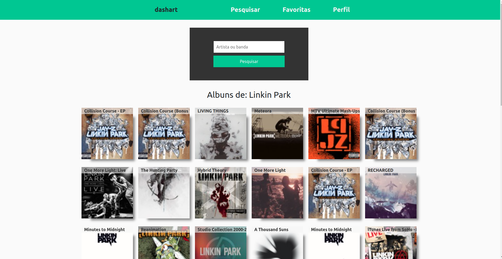

# Trybe Tunes

## Observações

Projeto desenvolvido ao cursar Desenvolvimento Web na [Trybe](https://www.betrybe.com/). <br>
  
Todo desenvolvimento realizado por mim se localiza na pasta /src. As outras partes desse projeto foram providas pela **Trybe**, como também a /src/services.<br>


## Contexto
  
 
 O TrybeTunes é uma aplicação capaz de reproduzir músicas das mais variadas bandas e artistas, criar uma lista de músicas favoritas e editar o perfil da pessoa usuária logada. Essa aplicação será capaz de:
  - Fazer login;
  - Pesquisar por uma banda ou artista;
  - Listar os álbuns disponíveis dessa banda ou artista;
  - Visualizar as músicas de um álbum selecionado;
  - Reproduzir uma prévia das músicas deste álbum;
  - Favoritar e desfavoritar músicas;
  - Ver a lista de músicas favoritas;
  - Ver o perfil da pessoa logada;
  - Editar o perfil da pessoa logada;
<br>
_________________________________

## Técnologias e conhecimentos colado em prática
  - React;
  - React Router Dom;
  - Consumo de API [Itunes](https://www.apple.com/br/itunes/)

_________________________________

## Executando aplicação
  É necessário possuir o Git <br>
  Abrindo o terminal, execute: <br>
  ```
  git clone git@github.com:jonatasqueirozlima/trybe-tunes.git
  cd trybe-tunes
  npm install && npm start
  ```
  O Frontend está disponível na url: http://localhost:3000/
_________________________________